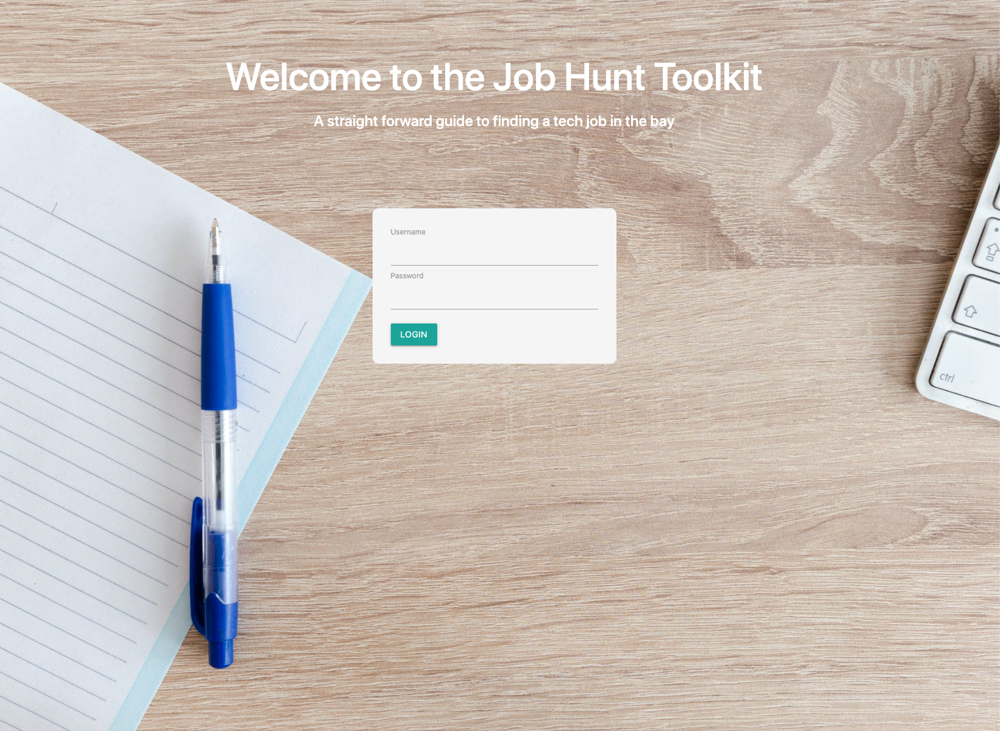
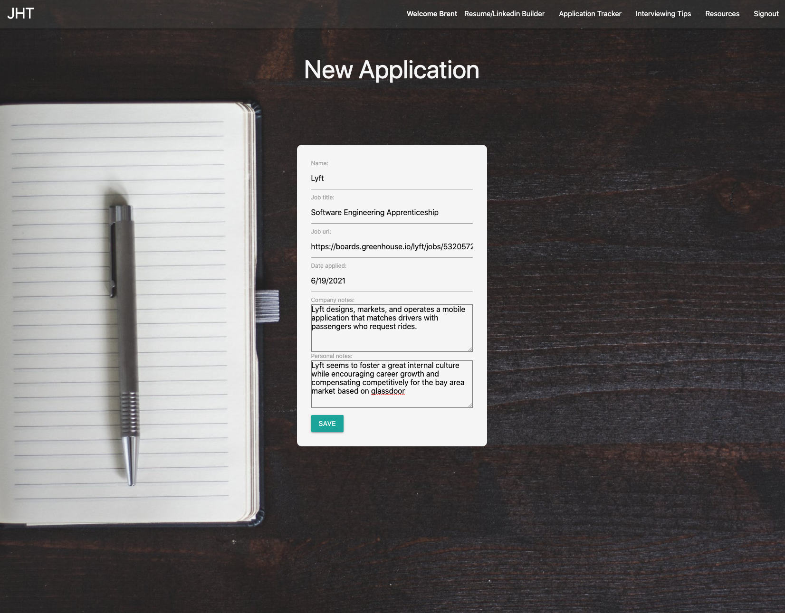
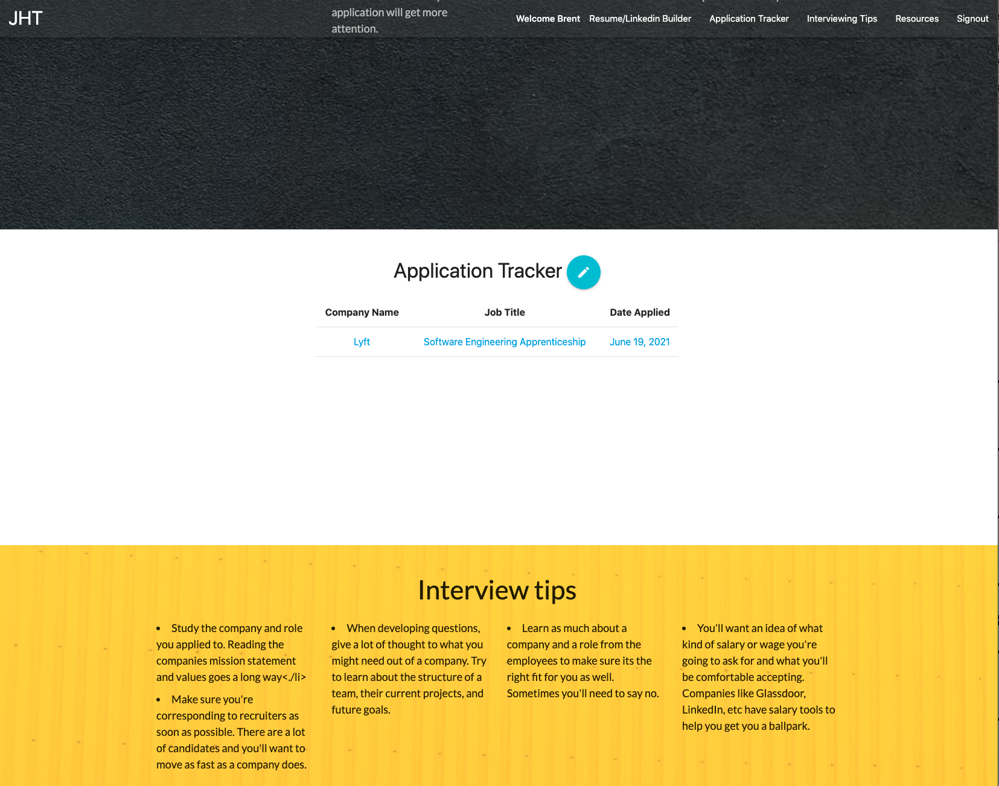

# The Job Hunt Toolkit

## About the project

This appplication was created to help people looking for a job who may want some guidelines to getting started. Specifically, someone looking for a tech job around the bay area. It contains blog content and a tracker to organize applications

**Live Site - https://job-hunt-toolkit.herokuapp.com/**

## Wireframe

- 
- 
- 

  

  

  

## Technologies

- HTML
- CSS
- Python
- Materialize
- Django
- Jinja
- PostgreSQL

## Wish list/Future Development

- User can check off items in Resume/LinkedIn,
- Progress bars for the user when they check items off,
- Calendar functionality with the applications,
- Reminder functionality, via email or text, with the applications,
- A place to store a resume,
